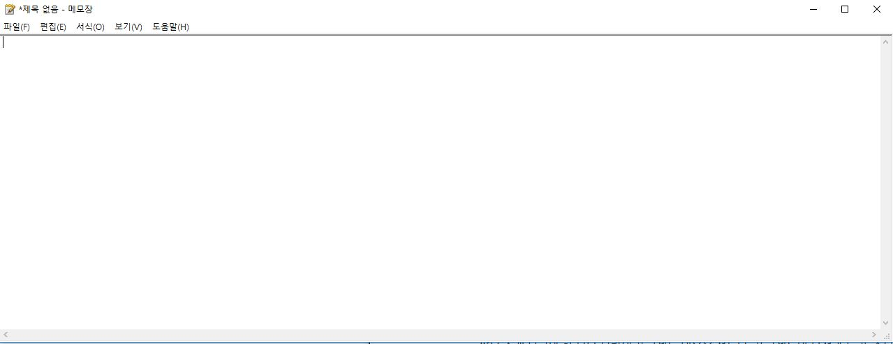

# PROJECT TITLE
***
Identical functionality with windows notepad.
# Motivation
***
This project was created for making clean code, using win32 api well.  
So just for practice.
# Code Style
***
We use BSD style for bracket.
# Screenshots
***

# framework used
***
used win32 api
# features
***
Feature: can change language manually 
# installation 
***
No need to further work to complie.  
So easy to build.
But because of notepad.vcxproj you may fail to compile.
Then you need to try compile several time. 
You also need to close IDE and then re-open it.
# Contribute
***
wanttobenno : original writer  
kesim : committer  
GyurimShim : contributor  
# Credits
***
original repository  
[wanttobeno's notepad](https://github.com/wanttobeno/notepad)
# License
***
We use GPL-3.0 license.

