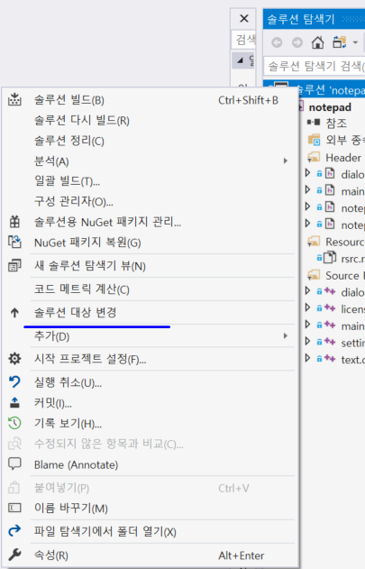
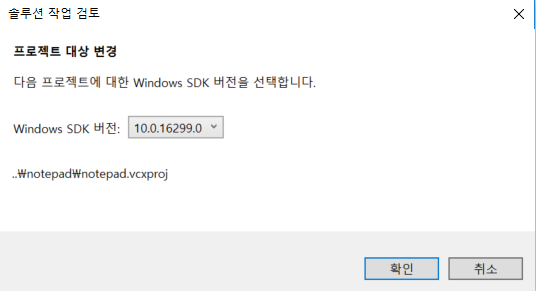

# Install
***
When you fail to compile follwing these steps.  
(Maybe your notepad.vcxproj file does not compatible with your computer)  
  
Right click your solution and then click 'solution target change'  
  
Then you'll see current version of SDK.  
You change it older version and compile it.  
Then you change it current version again and compile it.
Then you turn off your IDE and restart it.
Now you can compile it.
