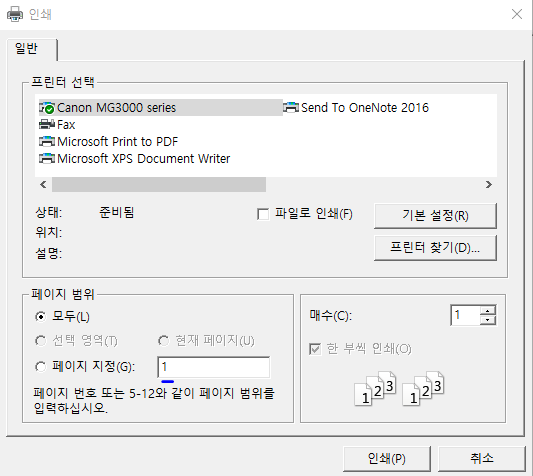
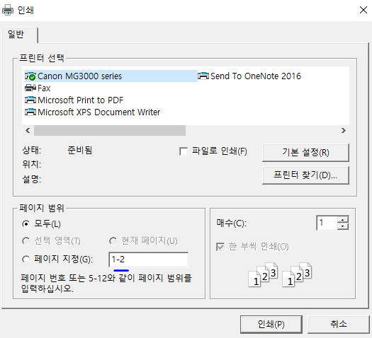
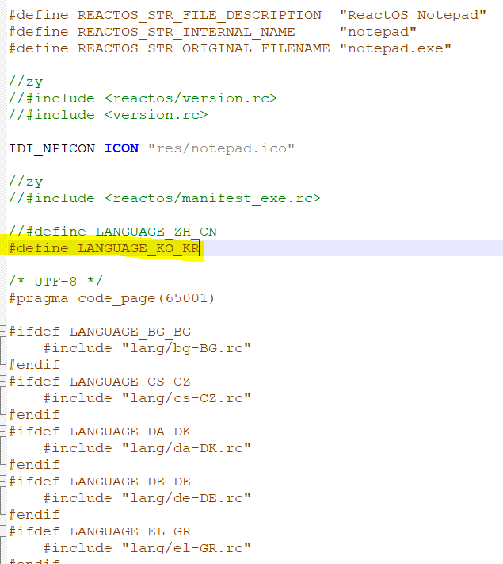

# USAGE
***
Using method is equal to windows notepad!!  
But I introduce you some notice.  
## print
***
When you print, you'll see the dialog  
  
You only see number 1, then you can print page up to 1 page.  
  
Or you see '1-2' like this. Then you can print page up to 2 pages.
So don't modify max page over maximum page number.  
## change languages
***
When you want to change languages, you manually change your resource file.  
Maybe you cannot open resource file 'rsrc.rc' in the notepad folder. I don't know why this not open.  
So you open it with notepad.  
  
You can change define in order to change language.  
Unless the language you want is there, you cannot choose it!
